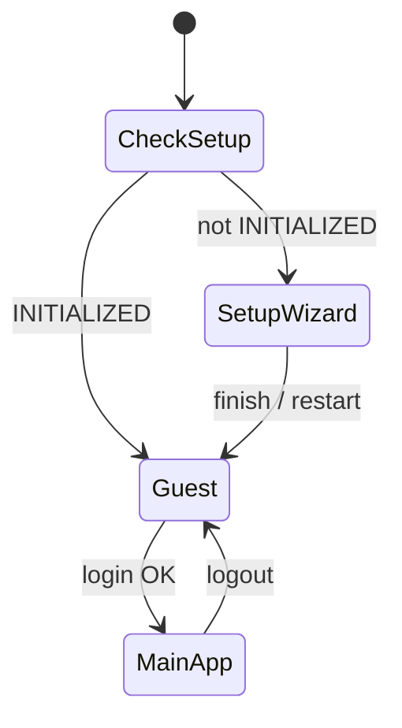

# Client — Technical Documentation

**Java Swing** desktop application communicating with the inventory server over HTTP/JSON. Targets **Java 8** bytecode; built with JDK 17 and Maven.

## Dependencies

| Library | Purpose |
|---------|---------|
| Gson | JSON serialization |
| JDK Swing | UI toolkit |

Packaged as a shaded JAR: `inventory-client-1.0.0.jar`.

## Package Structure

```
com.group4.inventoryclient/
├── Main.java                    # Entry: L&F, setup vs guest routing
├── config/
│   └── ClientConfig.java        # server.url from properties or --server-url
├── api/
│   ├── ApiClient.java           # HTTP GET/POST/PUT/DELETE, Bearer + Setup tokens
│   ├── SetupApiClient.java      # /setup/* endpoints
│   ├── AuthApiClient.java       # login, logout, me
│   ├── ProductApiClient.java    # ... per module
│   └── (Category, Supplier, Purchase, Sale, Icr, Stock, Report, User, Settings, Audit, Dashboard)
├── session/
│   └── SessionManager.java      # Singleton: token, user, permissions
├── ui/
│   ├── WizardFrame.java         # Initial setup wizard
│   ├── WizardStep.java          # Abstract step
│   ├── steps/                   # Status, RootAuth, Business, Roles, Permissions, Users, Finish
│   ├── GuestFrame.java          # Pre-login shell
│   ├── MainFrame.java           # Post-login shell (sidebar + CardLayout)
│   ├── components/              # PaginatedTable, SearchFilterBar, MetricCardPanel, FormDialog, ExportButton
│   ├── dashboard/               # Admin, Manager, Clerk, Cashier
│   ├── products/, categories/, suppliers/
│   ├── purchases/, sales/
│   ├── icr/, stock/
│   ├── reports/, users/, settings/, audit/
└── util/
    └── SwingUtil.java           # Messages, async helper
```

## Application Flow

```
Main
  └─► GET /api/setup/status (background thread)
        ├─ not INITIALIZED → WizardFrame
        └─ INITIALIZED     → GuestFrame
              └─ Login → SessionManager + Bearer on ApiClient
                    └─ MainFrame (dispose guest)
                          └─ Logout → GuestFrame
```



## Configuration

**File:** `src/main/resources/client.properties`

```properties
server.url=http://localhost:8080/api
```

**Override at launch:**

```bash
java -jar inventory-client-1.0.0.jar --server-url http://host:8080/api
```

`ClientConfig` resolves URL once at startup.

## ApiClient

- Base URL includes `/api` context path
- `setBearerToken` → `Authorization: Bearer ...` on authenticated calls
- `setSetupToken` → `X-Setup-Token` during setup wizard
- `ApiResponse`: `isSuccess()`, `getDataAsObject()`, `getDataAsArray()`, `getMeta()`, `getErrorMessage()`

All network I/O runs on **background threads**; UI updates use `SwingUtilities.invokeLater` or `SwingUtil` helpers.

## SessionManager

Singleton holding:

- JWT token and expiry (`expiresInSeconds` from login)
- User id, username, full name, role
- `Set<String> permissions` from login payload

`MainFrame` sidebar uses `hasPermission(code)` to show menu items.

**Note:** Permission codes in the UI should match server codes (e.g. `INVENTORY_CHANGE_REQUEST_CREATE`, `USER_MANAGE`, `AUDIT_LOG_READ`, `STOCK_MOVEMENT_READ`). Align setup wizard seeds with migration seeds for consistent navigation.

## UI Patterns

### Main shell

- `JSplitPane`-style layout: sidebar `JList` + `CardLayout` content
- One `JPanel` per module registered in `MainFrame.buildContentPanels()`
- Dashboard panel chosen by `session.getRole()`

### List modules

- `SearchFilterBar` — debounced search, combo filters
- `PaginatedTable` — page prev/next, `PageChangeListener` reloads API
- Toolbar: Add, Edit, Delete/Deactivate, Refresh, `ExportButton`

### Forms

- `FormDialog` subclass — `addField()`, `validateForm()`, `isConfirmed()`
- Modal dialogs owned by `MainFrame` as parent `Frame`

### Dashboards

- `MetricCardPanel` grid + optional `JTable` for recent rows
- `DashboardApiClient` loads role endpoint on construction (async)

## Threading Rules

- Never call `ApiClient` from the EDT
- Show errors with `SwingUtil.showError(parent, message)` (schedules EDT internally)
- Long operations: `new Thread(() -> { ... }).start()` or `SwingUtil.runAsync`

## Look and Feel

`UIManager.setLookAndFeel(UIManager.getSystemLookAndFeelClassName())` in `Main` for native OS appearance (Windows primary target).

## Build and Run

```bash
cd inventory-client
mvn clean package -DskipTests
java -jar target/inventory-client-1.0.0.jar
```

No separate config server; client is stateless except `SessionManager` in memory.

## Extension Points

1. Add `*ApiClient` methods for new endpoints  
2. Create `*ListPanel` / `*FormDialog` under `ui/<module>/`  
3. Register panel in `MainFrame.buildContentPanels()` and sidebar in `buildSidebar()`  
4. Gate sidebar with `session.hasPermission(...)`  

## Related

- [USER_GUIDE.md](../USER_GUIDE.md) — operator instructions
- [server/API.md](../server/API.md) — REST contract
- [RUN.md](../RUN.md) — startup order
