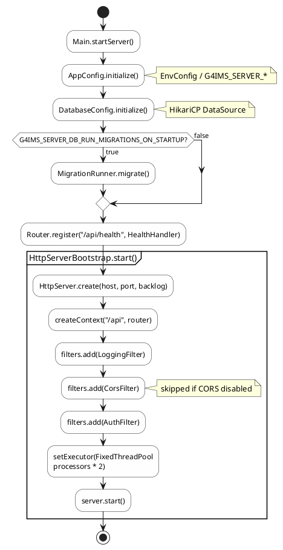
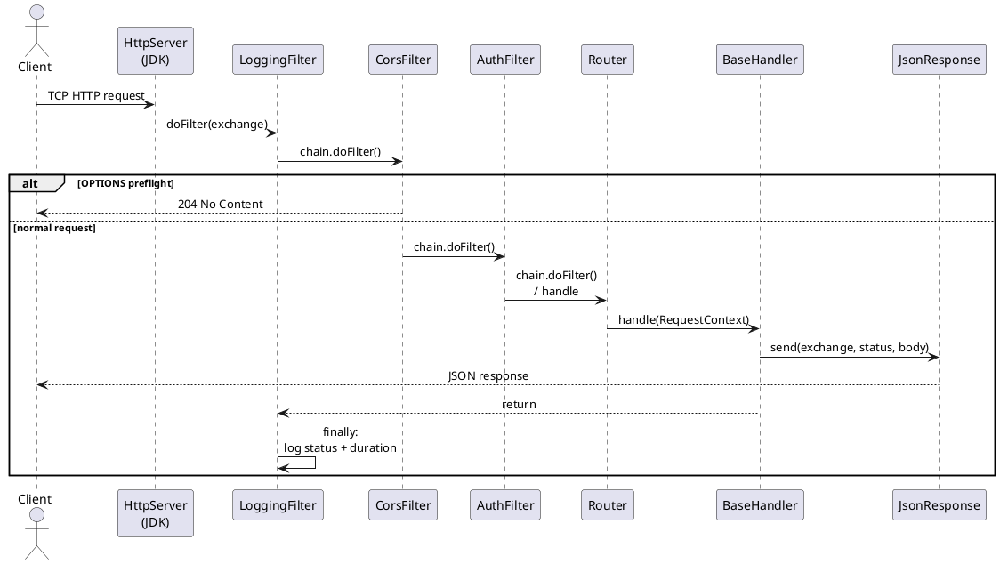
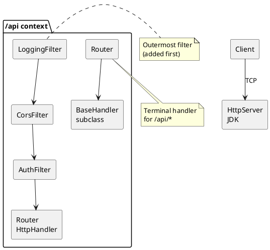
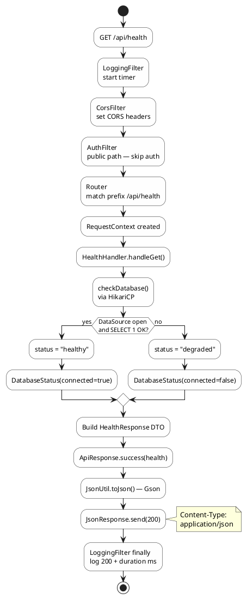

# Inventory Server — Request Lifecycle

Technical reference for how an HTTP request moves through the Group 4 inventory server from process startup to JSON response.

**Stack:** Java SE 8 bytecode, `com.sun.net.httpserver.HttpServer`, no servlet container.

**Diagrams:** PlantUML (`@startuml` / `@enduml`). Render with the PlantUML extension in VS Code or IntelliJ, or paste blocks into [plantuml.com](https://www.plantuml.com/plantuml/uml).

---

## 1. Process startup (before any request)

When `Main` runs with no CLI arguments, the server bootstraps in this order:

| Step | Class | Action |
|------|-------|--------|
| 1 | `AppConfig` | Reads `G4IMS_SERVER_*` via `EnvConfig`, creates storage/log directories |
| 2 | `DatabaseConfig` | Builds HikariCP `DataSource` (`initializationFailTimeout = -1` so startup does not block on DB) |
| 3 | `MigrationRunner` | Runs only if `G4IMS_SERVER_DB_RUN_MIGRATIONS_ON_STARTUP=true` |
| 4 | `Router` | Registers route prefixes → `BaseHandler` instances |
| 5 | `HttpServerBootstrap` | Binds `HttpServer`, attaches filter chain, starts thread pool |



**Shutdown hook:** `server.stop(3)` → `DatabaseConfig.shutdown()`.

**Configuration source:** All runtime values come from `System.getenv("G4IMS_SERVER_<KEY>")` in `EnvConfig` (116 variables). No `application.properties`.

---

## 2. Listener and context routing

| Setting | Env variable | Default |
|---------|--------------|---------|
| Bind address | `G4IMS_SERVER_SERVER_HOST` | `0.0.0.0` |
| Port | `G4IMS_SERVER_SERVER_PORT` | `8080` |
| Socket backlog | `G4IMS_SERVER_SERVER_BACKLOG` | `100` |
| API mount path | `G4IMS_SERVER_APP_CONTEXT_PATH` | `/api` |

`HttpServer.createContext(contextPath, router)` means:

- Requests whose URI path **starts with** `/api` are handled by the registered `Router` and its filter chain.
- Requests outside that context (e.g. `GET /`) are rejected by the JDK server with **404** before any application code runs.

**Concurrency:** Each accepted connection is dispatched on `Executors.newFixedThreadPool(availableProcessors() * 2)`. There is no request-scoped dependency injection; handlers must be thread-safe.

---

## 3. End-to-end request flow



### Filter chain order



Filters are registered in `HttpServerBootstrap` in this order (first added = outermost):

1. `LoggingFilter`
2. `CorsFilter` (skipped at registration if `corsEnabled()` is false)
3. `AuthFilter`

**Inbound:** Logging → CORS → Auth → `Router` (handler)  
**Outbound:** Handler completes → Auth → CORS → Logging (`finally` logs)

---

## 4. Middleware behavior

### 4.1 LoggingFilter

```java
// LoggingFilter.doFilter
long startTime = now();
try {
  chain.doFilter(exchange);  // entire downstream chain + handler
} finally {
  log.info("{} {} {} - {} ({}ms)",
      method, path, exchange.getResponseCode(), remoteAddr, duration);
}
```

- Wraps the full pipeline including response write.
- Uses `exchange.getResponseCode()` after the handler returns (set by `sendResponseHeaders`).
- Does not read or mutate the request body.

### 4.2 CorsFilter

Reads from `EnvConfig`:

- `G4IMS_SERVER_CORS_ALLOWED_ORIGINS`
- `G4IMS_SERVER_CORS_ALLOWED_METHODS`
- `G4IMS_SERVER_CORS_ALLOWED_HEADERS`

Sets response headers on every request:

```http
Access-Control-Allow-Origin: <origins>
Access-Control-Allow-Methods: <methods>
Access-Control-Allow-Headers: <headers>
Access-Control-Max-Age: 3600
```

**Preflight short-circuit:** If `RequestMethod == OPTIONS`, responds with **204** and `exchange.close()` — **Router and handlers never run**.

### 4.3 AuthFilter

**Public paths** (no `Authorization` required):

| Path |
|------|
| `/api/health` |
| `/api/auth/login` |
| `/api/public/welcome` |
| `/api/public/about` |
| `/api/public/contact` |
| `/api/public/inquiries` |

Matching rule: exact path **or** `path.startsWith(publicPath + "/")`.

**Also bypassed:** `OPTIONS` (CORS preflight).

**Protected paths (current boilerplate behavior):**

- If `Authorization` header starts with `Bearer `, the raw token is stored: `exchange.setAttribute("authToken", token)`.
- If the header is missing or malformed, the request **still proceeds** to the handler. JWT validation and 401 responses are deferred to future handler/service code (`JwtUtil` is available but not invoked in the filter yet).

---

## 5. Router

`Router` implements `HttpHandler` and is the terminal handler for the `/api` context.

### Route registration

```java
router.register(contextPath + "/health", new HealthHandler());
// Registers prefix: "/api/health"
```

### Matching algorithm

```java
for (Route route : routes) {
  if (path.equals(route.pathPrefix) || path.startsWith(route.pathPrefix + "/")) {
    // dispatch
    return;
  }
}
sendError(exchange, 404, "Not Found");
```

| Request path | Registered prefix | Match? |
|--------------|---------------------|--------|
| `/api/health` | `/api/health` | Yes (equals) |
| `/api/health/extra` | `/api/health` | Yes (prefix + `/`) |
| `/api/products` | `/api/health` only | No → 404 |
| `/api/healthcheck` | `/api/health` | No (no trailing `/` after prefix) |

**First registered match wins** (linear scan). Overlapping prefixes should be ordered deliberately when more routes are added.

### Dispatch and error handling

```java
RequestContext ctx = new RequestContext(exchange);
route.handler.handle(ctx);
```

| Exception | HTTP status | Response body |
|-----------|-------------|---------------|
| `ApiException` | `e.getStatusCode()` | `ErrorResponse` JSON |
| Any other `Exception` | 500 | `ErrorResponse` — message `"Internal Server Error"` |
| No route match | 404 | `ErrorResponse` — message `"Not Found"` |

Router-level errors use `ErrorResponse`, not `ApiResponse`.

---

## 6. RequestContext

Constructed once per matched route inside `Router.handle()`.

| Field | Source |
|-------|--------|
| `method` | `exchange.getRequestMethod().toUpperCase()` |
| `path` | `exchange.getRequestURI().getPath()` |
| `queryParams` | Parsed from `URI.getRawQuery()` (`key=value&...`) |
| `attributes` | In-memory `HashMap` (handler-scoped) |
| `body` | Lazy-read from `exchange.getRequestBody()` (UTF-8, line-concatenated) |

**Headers:** `getHeader(name)` → `exchange.getRequestHeaders().getFirst(name)`.

**Path remainder:** `getPathParam(basePath)` returns the segment after `basePath` (for future REST IDs).

**Auth token (when set by filter):** Available on the underlying `HttpExchange` via `exchange.getAttribute("authToken")` — not yet copied into `RequestContext`; handlers can read from `ctx.getExchange().getAttribute("authToken")`.

---

## 7. BaseHandler — HTTP verb dispatch

```java
public void handle(RequestContext ctx) throws IOException {
  switch (ctx.getMethod()) {
    case "GET":    handleGet(ctx);    break;
    case "POST":   handlePost(ctx);   break;
    case "PUT":    handlePut(ctx);    break;
    case "PATCH":  handlePatch(ctx);  break;
    case "DELETE": handleDelete(ctx);  break;
    default: throw new ApiException(405, "Method Not Allowed: " + method);
  }
}
```

Default implementations of `handleGet` / `handlePost` / etc. throw `ApiException(405, ...)`. Concrete handlers override only the verbs they support.

### Response helpers

| Method | Status | Body |
|--------|--------|------|
| `sendSuccess(ctx, data)` | 200 | `ApiResponse.success(data)` |
| `sendSuccess(ctx, data, code)` | custom | `ApiResponse.success(data)` |
| `sendCreated(ctx, data)` | 201 | `ApiResponse.success(data)` |
| `sendNoContent(ctx)` | 204 | empty (`Content-Length: -1`) |
| `parseBody(ctx, Class<T>)` | — | Deserializes JSON via `JsonUtil`; empty body → `ApiException(400)` |

Thrown `ApiException` propagates to `Router` and becomes an `ErrorResponse`.

---

## 8. Example: `GET /api/health`

Registered route: `/api/health` → `HealthHandler`.



### Database probe (`HealthHandler.checkDatabase`)

1. Fail fast if `DataSource` is null or closed.
2. `dataSource.getConnection()` from pool.
3. `conn.isValid(5)` — 5 second JDBC validation timeout.
4. `stmt.setQueryTimeout(5)` + `SELECT 1`.
5. On any failure: `DatabaseStatus(connected=false, responseTimeMs=elapsed)`.

Overall health string: `"healthy"` if connected, else `"degraded"`. HTTP status remains **200** in both cases (degraded is semantic, not HTTP 503).

### Success JSON envelope

```json
{
  "success": true,
  "data": {
    "status": "healthy",
    "appName": "Inventory Management System - Group 4 API",
    "appVersion": "1.0.0",
    "appEnv": "development",
    "timestamp": "2026-05-30T13:42:55Z",
    "database": {
      "connected": true,
      "responseTimeMs": 14
    }
  },
  "message": null
}
```

Serialized by `JsonUtil` (Gson) in `JsonResponse.send()`:

```java
exchange.getResponseHeaders().set("Content-Type", "application/json; charset=UTF-8");
exchange.sendResponseHeaders(statusCode, bytes.length);
exchange.getResponseBody().write(bytes);
```

---

## 9. Error JSON envelope

Produced by `Router.sendError()` for routing failures and uncaught exceptions:

```json
{
  "success": false,
  "status": 404,
  "message": "Not Found",
  "timestamp": "2026-05-30T13:42:55.123Z"
}
```

`ApiException` subclasses used by handlers:

| Class | Default status |
|-------|----------------|
| `ValidationException` | 422 |
| `UnauthorizedException` | 401 |
| `ForbiddenException` | 403 |
| `NotFoundException` | 404 |
| `ConflictException` | 409 |
| `ApiException` (base) | custom |

---

## 10. Request lifecycle matrix

| Stage | Component | Can terminate request? | Typical exit |
|-------|-----------|------------------------|--------------|
| TCP accept | `HttpServer` | Yes (wrong context path) | 404 JDK default |
| Outer log | `LoggingFilter` | No | — |
| CORS | `CorsFilter` | Yes (`OPTIONS`) | 204 |
| Auth | `AuthFilter` | No (boilerplate) | pass-through |
| Route match | `Router` | Yes (no match) | 404 JSON |
| Verb dispatch | `BaseHandler` | Yes (405) | 405 JSON |
| Business logic | `*Handler` | Yes (`ApiException`) | 4xx JSON |
| Serialize | `JsonResponse` | — | 2xx JSON body |
| Outer log | `LoggingFilter` `finally` | No | SLF4J INFO line |

---

## 11. Adding a new endpoint (extension point)

To wire a new route without changing the core pipeline:

1. Create `class FooHandler extends BaseHandler` and override `handleGet` / `handlePost` / etc.
2. Register in `Main.startServer()`:
   ```java
   router.register(contextPath + "/foo", new FooHandler());
   ```
3. If protected, do **not** add to `AuthFilter.PUBLIC_PATHS`; validate JWT in handler using `JwtUtil.validateToken(token)` on `exchange.getAttribute("authToken")`.
4. Use `parseBody(ctx, FooRequest.class)` for POST/PUT payloads.
5. Return data via `sendSuccess` / `sendCreated`; throw typed `ApiException` subclasses for errors.

The filter chain, `Router` error wrapping, and JSON envelopes remain unchanged.

---

## 12. Related source files

| Concern | Path |
|---------|------|
| Entry point | `com/group4/inventoryserver/Main.java` |
| Server bind + filters | `com/group4/inventoryserver/server/HttpServerBootstrap.java` |
| Routing | `com/group4/inventoryserver/server/Router.java` |
| Request wrapper | `com/group4/inventoryserver/server/RequestContext.java` |
| JSON output | `com/group4/inventoryserver/server/JsonResponse.java` |
| Middleware | `com/group4/inventoryserver/middleware/*.java` |
| Handler base | `com/group4/inventoryserver/handler/BaseHandler.java` |
| Health example | `com/group4/inventoryserver/handler/HealthHandler.java` |
| Env config | `com/group4/inventoryserver/config/EnvConfig.java` |
| DB pool | `com/group4/inventoryserver/config/DatabaseConfig.java` |
| JWT (future auth) | `com/group4/inventoryserver/security/JwtUtil.java` |
